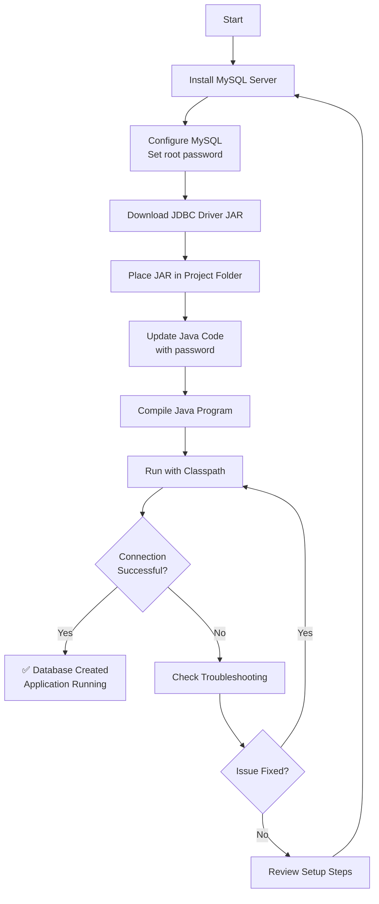
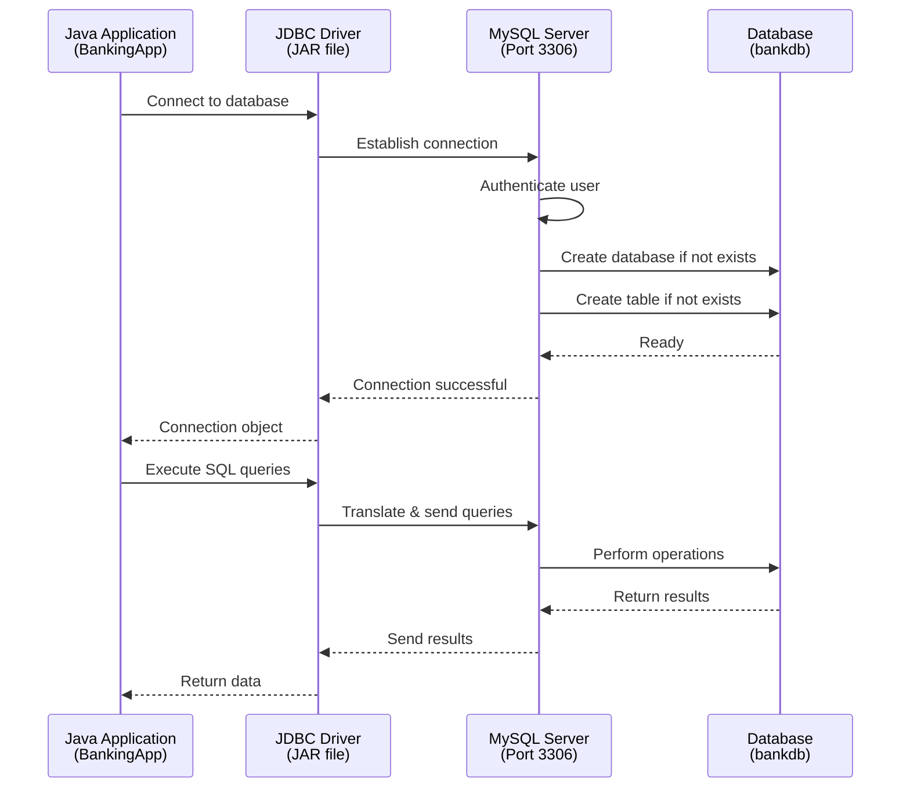

# Visual Setup Guide - Windows MySQL + JDBC

This is a visual companion to the detailed setup guide.

---

## 🎯 Complete Setup Flow



---

## 📁 Project Folder Structure

```
C:\Users\YourName\Desktop\Banking_management_system\
│
├── 📄 Bankingapp.java                    ← Your Java code
├── 📦 mysql-connector-j-8.0.33.jar      ← JDBC Driver (REQUIRED!)
├── 📄 WINDOWS_SETUP_GUIDE.md            ← Setup instructions
├── 📄 JDBC_README.md                     ← Additional documentation
│
└── After compilation:
    ├── 🔷 BankingApp.class
    ├── 🔷 BankAccount.class
    ├── 🔷 SavingsAccount.class
    └── 🔷 CurrentAccount.class
```

---

## 🔌 Connection Architecture



---

## 🚀 Command Cheat Sheet

### Windows Commands

| Task | Command |
|------|---------|
| **Navigate to project** | `cd C:\Users\YourName\Desktop\Banking_management_system` |
| **Compile Java** | `javac Bankingapp.java` |
| **Run Application** | `java -cp ".;mysql-connector-j-8.0.33.jar" BankingApp` |
| **Check MySQL Service** | `net start MySQL80` |
| **Stop MySQL Service** | `net stop MySQL80` |
| **Restart MySQL Service** | `net stop MySQL80 && net start MySQL80` |

### Important Notes

> ⚠️ **Windows uses semicolon** `;` in classpath (not colon `:`)
> 
> ⚠️ **Always include the JAR** in the `-cp` parameter
> 
> ⚠️ **Use quotes** around classpath if it contains spaces

---

## 🔍 Connection String Explained

```
jdbc:mysql://localhost:3306/bankdb
│    │      │         │     └─────── Database name (created automatically)
│    │      │         └───────────── Port (default MySQL port)
│    │      └─────────────────────── Host (localhost = your computer)
│    └────────────────────────────── Database type
└─────────────────────────────────── Protocol
```

### Code Example

```java
// In Bankingapp.java
static final String DB_URL = "jdbc:mysql://localhost:3306/bankdb";
static final String DB_USER = "root";
static final String DB_PASSWORD = "root123";  // ← Change this!

// Get connection
Connection conn = DriverManager.getConnection(DB_URL, DB_USER, DB_PASSWORD);
```

---

## ✅ Success Indicators

When everything is set up correctly, you'll see:

```
C:\...\Banking_management_system> java -cp ".;mysql-connector-j-8.0.33.jar" BankingApp

Database 'bankdb' is ready!              ← ✅ Database created
Table 'accounts' is ready!               ← ✅ Table created
Database initialized successfully!       ← ✅ Connection works
Loaded 0 accounts from database.         ← ✅ Ready to use

====BANK MENU====
1. Create Account
2. Deposit
3. Withdraw
4. Show Details
5. Apply Interest
6. Exit
Enter your choice: _
```

---

## ❌ Common Errors & Quick Fixes

### Error 1: No suitable driver found

```
❌ Error: No suitable driver found for jdbc:mysql://localhost:3306/
```

**Quick Fix:**
```cmd
✅ Make sure JAR is in project folder
✅ Use: java -cp ".;mysql-connector-j-8.0.33.jar" BankingApp
✅ Check semicolon (;) not colon (:)
```

---

### Error 2: Access denied

```
❌ Error: Access denied for user 'root'@'localhost'
```

**Quick Fix:**
```java
✅ Check password in Bankingapp.java
✅ Update: static final String DB_PASSWORD = "your_password";
✅ Recompile: javac Bankingapp.java
```

---

### Error 3: Communications link failure

```
❌ Error: Communications link failure
```

**Quick Fix:**
```cmd
✅ Start MySQL service:
   net start MySQL80

✅ Check in services.msc:
   Windows + R → services.msc → Find MySQL80 → Start
```

---

### Error 4: javac not recognized

```
❌ 'javac' is not recognized as an internal or external command
```

**Quick Fix:**
```
✅ Install JDK (Java Development Kit)
✅ Add to PATH:
   - This PC → Properties → Advanced → Environment Variables
   - System Variables → Path → Edit → New
   - Add: C:\Program Files\Java\jdk-XX\bin
   - Restart Command Prompt
```

---

## 📊 Setup Verification Checklist

Use this checklist to verify your setup:

```
Step 1: MySQL Installation
  ☐ MySQL Server installed
  ☐ MySQL Workbench installed (optional but helpful)
  ☐ Root password set and remembered

Step 2: MySQL Service
  ☐ MySQL80 service is running
  ☐ Can connect via MySQL Workbench (optional test)
  ☐ Port 3306 is open

Step 3: JDBC Driver
  ☐ Downloaded mysql-connector-j-8.0.33.jar
  ☐ JAR file is in project folder
  ☐ JAR filename matches in run command

Step 4: Java Code
  ☐ DB_PASSWORD updated with your password
  ☐ Code compiles without errors
  ☐ All .class files generated

Step 5: Run Application
  ☐ Used correct classpath with semicolon
  ☐ See "Database 'bankdb' is ready!" message
  ☐ See "Table 'accounts' is ready!" message
  ☐ Application menu appears
```

---

## 🎓 Understanding the Technology Stack

```
┌─────────────────────────────────────┐
│     Java Application Layer          │
│  (Your BankingApp.java code)        │
└──────────────┬──────────────────────┘
               │
               ↓
┌─────────────────────────────────────┐
│     JDBC API Layer                  │
│  (Java Database Connectivity)       │
└──────────────┬──────────────────────┘
               │
               ↓
┌─────────────────────────────────────┐
│     JDBC Driver Layer               │
│  (mysql-connector-j-8.0.33.jar)     │
└──────────────┬──────────────────────┘
               │
               ↓
┌─────────────────────────────────────┐
│     MySQL Server                    │
│  (Running on localhost:3306)        │
└──────────────┬──────────────────────┘
               │
               ↓
┌─────────────────────────────────────┐
│     Database Storage                │
│  (bankdb database on disk)          │
└─────────────────────────────────────┘
```

---

## 🔗 Quick Links

- **MySQL Download**: https://dev.mysql.com/downloads/installer/
- **JDBC Driver Download**: https://dev.mysql.com/downloads/connector/j/
- **Maven Repository (Alternative)**: https://repo1.maven.org/maven2/com/mysql/mysql-connector-j/
- **MySQL Documentation**: https://dev.mysql.com/doc/
- **JDBC Tutorial**: https://docs.oracle.com/javase/tutorial/jdbc/

---

## 💡 Pro Tips

1. **Save your MySQL password** in a safe place - you'll need it often!

2. **Create a batch file** to run your application easily:
   ```batch
   @echo off
   java -cp ".;mysql-connector-j-8.0.33.jar" BankingApp
   pause
   ```
   Save as `run.bat` and double-click to run!

3. **Use MySQL Workbench** to view your database visually:
   - Connect to localhost
   - Expand "Schemas" → "bankdb" → "Tables" → "accounts"
   - Right-click table → "Select Rows" to see data

4. **Keep the JAR file** in your project - don't delete it!

5. **Backup your database** before major changes:
   ```cmd
   mysqldump -u root -p bankdb > backup.sql
   ```

---

**Happy Coding! 🚀**
